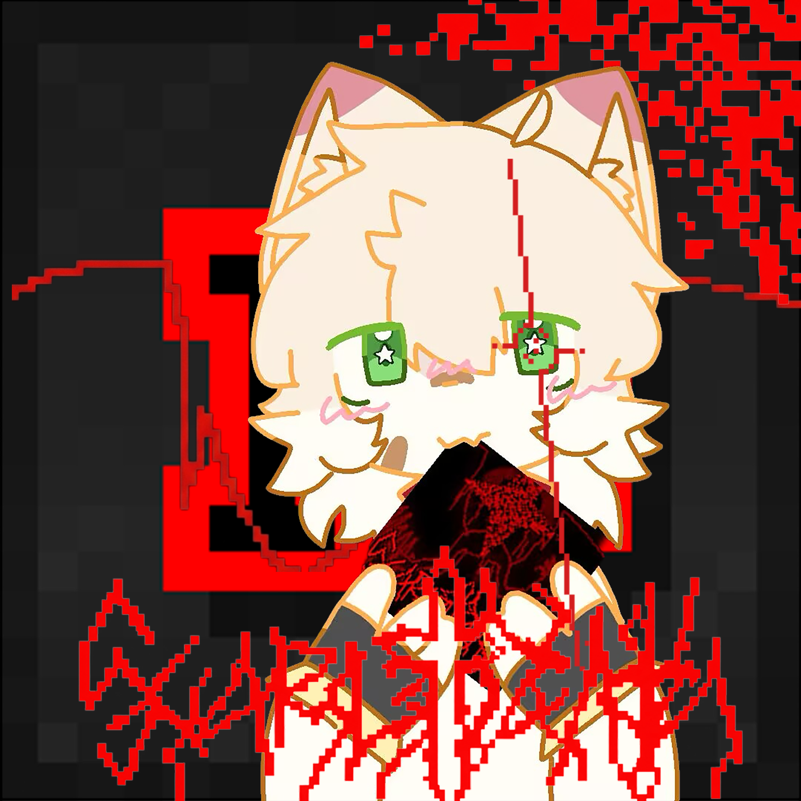

<p align="center">
  
</p>

<h1 align="center">KuroakiGimmick</h1>

<p align="center">
  面向《vivid/stasis》的谱面演出预览与编辑工具。<br>
  在时间轴上编排 gimmick、图片、字幕、场景效果与窗口运动，并直接检查它们在实际歌曲场景中的表现。
</p>

<p align="center">
  
  
  
  
</p>

<p align="center">
  <a href="#项目定位">项目定位</a> ·
  <a href="#功能">功能</a> ·
  <a href="#快速开始">快速开始</a> ·
  <a href="#编辑与导出">编辑与导出</a> ·
  <a href="#构建应用包">构建应用包</a> ·
  <a href="#开发与验证">开发与验证</a> ·
  <a href="#文档">文档</a>
</p>

> 本仓库提供 KuroakiGimmick 的编辑器源码、应用图标以及界面字体资源。
>
> 《vivid/stasis》的游戏资源不会随仓库分发。源码可以独立构建，但完整场景预览、部分验证流程和发行包构建需要自行准备合法取得的本地资源。

## 项目定位

KuroakiGimmick 主要解决的是 **演出制作与验证**。

它可以读取《vivid/stasis》的谱面和演出数据，将音符、HUD、gimmick、图片、字幕以及部分窗口效果放进同一条时间轴中预览，并提供对应的可视化编辑能力。

它并不是完整的音符制谱器，也不试图重新实现整个 GameMaker 运行时。

适合的用途包括：

- 制作和调整 VSM gimmick 演出；
- 编排图片、字幕和 Custom Proxy；
- 检查 gimmick 与实际音符时间线的配合；
- 预览窗口运动与多窗口演出；
- 对复杂演出进行循环、定位和逐段调试；
- 将工程导出为游戏侧可使用的文件或视频。

对于无法完全模拟的原生 GameMaker 行为，KuroakiGimmick 会尽量提供可检查的兼容行为，而不是假装自己就是游戏本体。最终效果仍应以实际游戏运行结果为准。

## 功能

| 功能 | 支持内容 |
| --- | --- |
| 演出预览 | 读取 VSB / VSC 谱面、VSM 演出、VSP 图片声明以及 SGV 工程，在歌曲场景中显示音符、判定效果、HUD 与演出。 |
| 时间轴编辑 | 编辑事件时间、持续时间与缓动；支持音符吸附、循环试听、时间标记、批量操作、片段拆分／合并以及撤销重做。 |
| 图片动画 | 独立图片画布，可调整初始姿态和关键帧，支持位置、缩放、旋转、路径续接与资源替换。 |
| 文字与字幕 | 编辑字幕内容、时间和样式，并通过文字画布调整位置、排版、颜色及动画端点。 |
| 场景效果 | 支持 Custom Proxy 裁剪与变换、部分原生 gimmick、粒子、film 等效果；预览与视频输出共用主要渲染流程。 |
| 窗口运动 | 提供虚拟桌面与真实辅助窗口预览，并支持部分 ExtCustomGimmick 窗口事件和 Proxy 内容绑定。 |
| 工程与导出 | 保存 SGV 工程，并导出 VSM、VSM + cgmk config、Chart Folder 或 MP4。 |
| 编辑工作区 | 中英双语、可调布局与 UI 缩放、主题、F1 离线文档、轨道说明以及编辑辅助工具。 |

界面语言可在：

**SETTINGS / 设置 → Language**

中切换为：

- 跟随系统
- 中文
- English

语言设置会保存，但不会修改用户输入的字幕、谱面标识符或工程内容。

## 快速开始

### 环境要求

| 项目 | 要求 |
| --- | --- |
| .NET | .NET 8 SDK，或能够构建 `net8.0` 项目的后续 SDK |
| macOS | Metal；支持 Apple Silicon / Intel 构建 |
| Windows | Direct3D 12；支持 x64 / ARM64 构建 |
| 游戏资源 | 完整场景预览和部分测试需要项目根目录下的本地 `Assets/` |
| 音视频 | Ogg/Vorbis 预览内置解码；其他音频格式和视频导出需要 FFmpeg |

首次恢复 NuGet 依赖需要网络连接。

当前没有 Linux 交互式图形后端。

能够完成跨平台编译，并不代表对应平台已经完成实际运行验证。因为显然“编译器没骂人”和“程序真的能正常跑”是两种完全不同的成功。

### 编译

在仓库根目录执行：

```bash
dotnet restore KuroakiGimmick.csproj --locked-mode
dotnet build KuroakiGimmick.csproj -c Release --no-restore
```

### 启动

准备好本地 `Assets/` 后，可以直接打开一个 SGV 工程：

```bash
dotnet run --project KuroakiGimmick.csproj -c Release --no-build -- \
  --editor /path/to/project.sgv.json
```

省略工程路径时也可以直接进入程序，再手动打开谱面或工程。

项目同时提供启动脚本。

macOS：

```bash
bash scripts/run-editor.command /path/to/project.sgv.json
```

Windows PowerShell：

```powershell
.\scripts\run-editor.ps1 -Project 'C:\Charts\project.sgv.json'
```

启动脚本在未指定工程时会尝试打开：

```text
Samples/EditorDemo/demo.sgv.json
```

`Samples/` 不包含在公开仓库中，因此公开版本通常需要显式指定自己的工程。

可以通过环境变量覆盖外部工具位置：

```text
KUROAKI_DOTNET
KUROAKI_FFMPEG
```

FFmpeg 也可以直接放入 `PATH`。

仓库中的资源处理脚本只负责 KuroakiGimmick 所需的部分资源，不用于重建或分发完整的游戏 `Assets/`。

## 编辑与导出

一个通常的工作流程如下：

1. **打开素材**

   使用 `OPEN CHART / VSM` 打开谱面、VSM 或 SGV 工程，也可以拖入歌曲目录。

   通过 `+ FILES / RESOURCES` 添加图片、音频和其他工程资源。

2. **编辑演出**

   按 `Tab` 进入编辑工作区，在时间轴中创建或修改事件。

   使用 `IMAGES`、`TEXT` 等工具编辑图片与字幕，并通过 `SCENE` 检查最终歌曲场景。

3. **保存工程**

   使用 `SAVE / SAVE AS` 保存 `.sgv.json` 及相关编辑数据。

   SGV 工程可以引用外部资源，因此移动工程时需要同时保留对应文件。

4. **检查并导出**

   使用 `REVIEW FILES` 查看即将写入的文件和警告，再执行 `EXPORT COPY`。

   导出目标目录必须不存在，以避免无提示覆盖已有谱面资源。

### 导出格式

| 导出方式 | 输出内容 |
| --- | --- |
| VSM | 当前演出文本；不自动包含 VSP、图片或字幕资源。 |
| VSM + cgmk config | VSM 以及对应窗口配置；不自动包含其他资源文件。 |
| Chart Folder | 当前难度所需的演出、VSP、图片、字幕等依赖，并附带可重新打开的预览工程。 |
| Video | H.264 / AAC MP4；画面和音频遵循谱面的 `playspeed` 以及已支持的音乐跳转行为。 |

Chart Folder 不负责安装游戏扩展，也不保证收集同一歌曲其他难度使用的全部资源。

视频导出只记录歌曲场景。

虚拟桌面、系统窗口位置以及多个真实原生窗口不会被录制进单一视频画面。

### 常用快捷键

| 快捷键 | 操作 |
| --- | --- |
| `Tab` | 切换预览 / 编辑工作区 |
| `Space` | 播放 / 暂停 |
| `Ctrl/⌘ + O` | 打开 |
| `Ctrl/⌘ + S` | 保存 |
| `Ctrl/⌘ + Shift + S` | 另存为 |
| `Ctrl/⌘ + Z` | 撤销 |
| `Ctrl/⌘ + Shift + Z` | 重做 |
| `E` | 创建或激活时间标记 |
| `Shift + E` | 取消固定标记 |
| `A` | 设置循环起点 |
| `B` | 设置循环终点 |
| `L` | 开关循环 |
| `F1` | 打开离线手册 |
| 长按 `W` | 查看轨道详细说明 |

循环、图片、字幕、保存行为以及工程结构的详细说明见：

[编辑与导出指南](docs/EDITING_GUIDE.md)

## 构建应用包

发行包构建需要完整的本地 `Assets/`。

生成的应用包含 .NET 运行时，因此目标机器无需单独安装 .NET。

### macOS

```bash
# arm64 / x64 / all
bash scripts/publish-mac.sh arm64
```

### 从 macOS 交叉构建 Windows

```bash
# x64 / arm64 / all
bash scripts/publish-win.sh x64
```

### Windows PowerShell

```powershell
.\scripts\publish-windows.ps1 -Arch x64
```

输出目录类似：

```text
dist/
└── KuroakiGimmick-v0.1.3-<RID>-17.0-<timestamp>/
```

同时会生成对应 ZIP。

使用 `all` 时会分别构建两个架构，不会生成 macOS Universal Binary。

macOS 包结构中 `.app` 与 `Assets/` 并列。

Windows 包使用单文件 `.exe`，同时保留外置 `Assets/`。

因此无论哪个平台，移动发行版本时都应移动整个目录，而不是只把可执行文件单独拖走，然后疑惑为什么所有资源突然蒸发。

macOS 构建会在可用时执行 ad-hoc 签名，但不会进行 Apple notarization。

如果打包时指定 FFmpeg，需要提供与目标操作系统和 CPU 架构匹配的可执行文件。

包含《vivid/stasis》非公开游戏资源的发行包仅应在拥有对应资源使用权的前提下本地使用，不应随公开仓库重新分发。

## 开发与验证

当前版本：

**v0.1.3 / Build 17.0**

实际版本号以 [`KuroakiGimmick.csproj`](KuroakiGimmick.csproj) 为准。

### 基础验证

macOS / Unix：

```bash
bash scripts/verify.sh
```

在具有可用 Metal / Direct3D 12 图形环境的机器上追加 GPU 测试：

```bash
bash scripts/verify.sh --gpu
```

Windows PowerShell：

```powershell
.\scripts\verify.ps1
```

GPU 验证：

```powershell
.\scripts\verify.ps1 -Gpu
```

仅执行源代码结构检查：

```bash
python3 scripts/dev/check-source.py
```

统一验证入口会覆盖核心解析、编辑器行为、文档、导出、文字与 film、Custom、原生序列、布局以及图片对象等组件。

部分测试依赖本地游戏资源。

失败时验证脚本会停止，而不是继续跑完然后用一大串绿色输出试图掩盖前面已经炸掉的东西。

### 当前验证状态

截至 **2026-09-20** 的开发版本：

- Release 构建：0 warning / 0 error
- 基础测试：310 项
- 编辑器测试：694 项
- Metal GPU 测试：27 项
- 文字 / film 渲染检查通过
- Windows 原生运行仍需要更多实机验证

这些数字只是对应提交时的开发状态，不属于稳定 API 或兼容性保证。

更完整的专项记录见：

- [中英双语与字体](docs/I18N.md)
- [Custom Proxy 与循环修复](docs/CUSTOM_PROXY_AND_LOOPS.md)

<details>

<summary>命令行诊断、截图与视频导出</summary>

查看帮助：

```bash
dotnet run -c Release --no-build -- --help
```

检查谱面：

```bash
dotnet run -c Release --no-build -- \
  --inspect /path/chart.vsb \
  --time 45
```

生成场景截图：

```bash
dotnet run -c Release --no-build -- \
  --snapshot /path/project.sgv.json \
  --scene \
  --time 45 \
  --out frame.ppm \
  --report frame.json \
  --strict
```

渲染视频：

```bash
dotnet run -c Release --no-build -- \
  --render /path/project.sgv.json \
  --start 30 \
  --end 45 \
  --fps 60 \
  --width 1920 \
  --out clip.mp4 \
  --strict
```

`--inspect` 不执行 GPU shader 编译验证。

截图和视频导出需要可用的图形后端。

`--strict` 会将对应渲染错误作为命令失败返回。

可以通过：

```text
--language zh-CN
--language en
--language auto
```

指定本次运行使用的界面语言。

完整参数始终以：

```bash
--help
```

为准。

### 音频内存限制

解码后的浮点 PCM 数据最大允许：

```text
1,024,000,000 bytes
```

也就是约 **1024 MB**。

这里限制的是**解码后的 PCM 数据**，不是 `.ogg`、`.mp3` 等压缩文件本身的大小。

例如，一段约 16 分钟、44.1 kHz、双声道音频解码后大约会占用 337 MB；程序运行时还需要额外的图形资源、编辑数据以及解码和渲染缓冲区。

</details>

## 文档

| 主题 | 文档 |
| --- | --- |
| 编辑操作 | [编辑与导出指南](docs/EDITING_GUIDE.md) · [图片对象](docs/IMAGE_OBJECTS_16_2.md) · [布局与图片导入](docs/LAYOUT_IMAGES_16_1.md) |
| 演出兼容 | [渲染与兼容行为](docs/RENDERING_BEHAVIOR.md) · [Custom Proxy 与循环修复](docs/CUSTOM_PROXY_AND_LOOPS.md) · [窗口运动](docs/WINDOW_MOVEMENT_V0.1.1.md) |
| 界面与帮助 | [中英双语与字体](docs/I18N.md) · [F1 文档界面](docs/DOCS_UI_PREVIEW9.md) |
| 开发扩展 | [架构](docs/ARCHITECTURE.md) · [通用对象定义](docs/OBJECT_DEFINITIONS.md) · [导出与 E 标记](docs/EXPORT_AND_MARKERS_V0.1.2.md) |
| 项目历史 | [更新日志](CHANGELOG.md) · [历史资料](docs/history/README.md) |

### 仓库结构

```text
src/
    应用入口、核心模型、解析、编辑、渲染、原生接口与 UI

tests/
    C# 自测与兼容性契约

scripts/
    启动、构建、打包和验证脚本
    dev/    开发辅助工具
    assets/ 本地资源处理工具

Assets/App/
    KuroakiGimmick Logo 与应用图标

Resources/Fonts/
    随程序集提供的界面字体资源

ThirdParty/
    第三方组件许可证与声明

docs/
    使用说明、架构文档、兼容性记录与历史资料
```

以下内容不会随公开仓库提供：

```text
Assets/       除 Assets/App/ 之外的游戏资源
Samples/      本地示例工程
Integrations/ 本地集成文件
bin/
obj/
dist/
*.zip
```

## 兼容性边界

KuroakiGimmick 不执行任意 GML，也不完整模拟 GameMaker。

因此以下内容可能只能部分预览：

- 依赖游戏运行时内部状态的逻辑；
- 未实现的原生对象行为；
- 动态创建或修改的特殊实例；
- 与实际操作系统窗口生命周期强绑定的效果；
- 特定版本游戏内部行为；
- 尚未实现的专用 gimmick。

复杂演出建议同时使用：

1. 编辑器时间轴；
2. `SCENE` 实际场景预览；
3. 兼容性／诊断报告；
4. 最终游戏端实机运行。

历史文档中的行为、限制和验证结果只代表对应版本，不应直接视为当前版本行为。

## 资源与声明

`Assets/App/` 包含 KuroakiGimmick 自身使用的：

- Logo
- Windows 应用图标
- macOS 应用图标

其他 `Assets/` 内容，例如游戏图像、音符皮肤、音频、谱面以及演出素材，其原始权利归《vivid/stasis》及对应权利人所有。

本仓库不会提供这些游戏资源的公开下载，也不会授予相关内容的重新分发权。

`.gitignore` 仅允许跟踪：

```text
Assets/App/
```

其他游戏资源、原始导出文件、`Samples/`、`Integrations/`、构建目录以及发行压缩包继续保持忽略。

第三方组件及许可证：

[THIRD_PARTY_NOTICES.md](THIRD_PARTY_NOTICES.md)

字体资源说明：

[Resources/Fonts/README.md](Resources/Fonts/README.md)

IBM Plex 衍生字体所使用的 SIL Open Font License 1.1：

[ThirdParty/IBM-Plex-OFL.txt](ThirdParty/IBM-Plex-OFL.txt)
